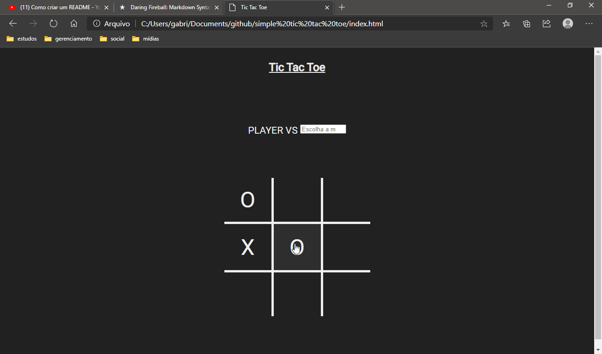

# TIC TAC TOE🎮



## Sobre📖
Jogo da velha feito com javaScript puro que conta com um modo single player e um modo multiplayer local.

## Tecnologias👩‍💻
- HTML5
- CSS3
- JavaScript

## Baixar e iniciar o projeto🎓
1) Abra o terminal e entre na pasta onde quer deixar o projeto
2) Rode o seguintes comandos:</br>
```
// clonando o projeto
git clone https://github.com/gabriel271/simple-tic-tac-toe

//entrando na pasta do projeto
cd simple-tic-tac-toe

//abrindo o projeto
index.html

```
